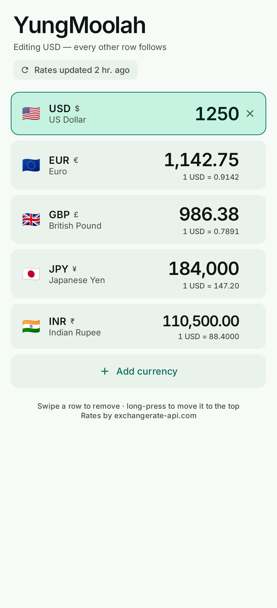
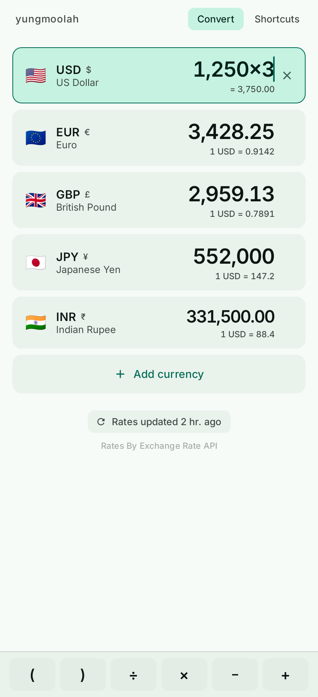
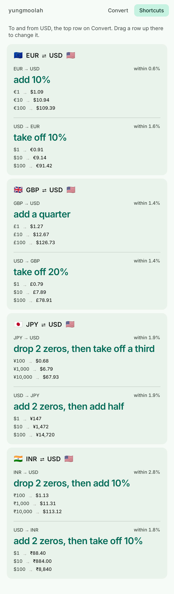
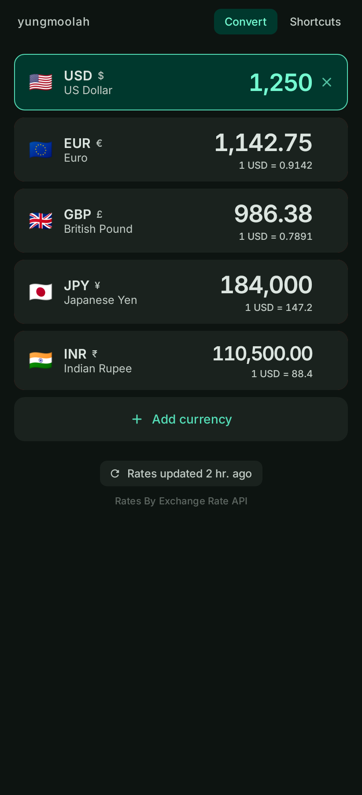

# yungmoolah

A multi-currency converter for Android. Every pinned currency is a live, editable
field on one page: type an amount into any of them and the rest recompute
instantly. Rates come from the network once a day, are cached on disk, and keep
working offline.

<p align="center">
  
  
  
  
</p>

## What it does

- **Edit any row.** There is no "from" and "to" picker. Whichever amount you type
  into becomes the source and every other pinned currency follows it.
- **166 currencies**, each with its own flag, symbol and correct number of decimal
  places, so yen show no cents and dollars do.
- **Works offline.** The last downloaded rates are stored on the device and shown
  immediately at launch. When the network is missing, the status chip says so and
  names how old the numbers are rather than pretending they are current.
- **Refreshes in the background.** A WorkManager job checks for new rates every six
  hours when there is a connection, and survives reboots. Pull down to refresh by
  hand.
- **Pin, reorder, remove.** Add from a searchable list of every supported currency,
  swipe a row away (with undo), long-press and drag one to reorder.
- **Clear in one tap.** The row being edited carries a clear button; clearing it
  blanks every row so you can start a new figure.
- **Grouped as you type.** The row being edited gains thousands separators
  keystroke by keystroke, and the caret stays at the end wherever you tap.
- **Tap anywhere else** to drop the highlight and put the keyboard away.
- **Do sums in the field.** Type `24.50×3` or `(80+15)÷4` and every row follows the
  running total, which is shown under the row you are editing. The system's number
  pad has no operators, so a bar of arithmetic keys appears above it while you type.
- **A Shortcuts tab** for when the phone stays in your pocket: for each pinned
  currency, how to convert it into your home currency in your head, and a ladder of
  round amounts to recognise on sight.

## Install

Grab `app-release.apk` from `app/build/outputs/apk/release/` (or the debug APK from
`app/build/outputs/apk/debug/`), copy it to the phone and open it. Android will ask
you to allow installing from your file manager or browser the first time.

Requires Android 7.0 (API 24) or newer.

## Build

Needs a JDK (17+) and the Android SDK with platform 35 and build-tools 35.0.0.
Point `local.properties` at the SDK (`sdk.dir=/path/to/android-sdk`), then:

```bash
./gradlew assembleDebug     # installable, signed with the local debug key
./gradlew testDebugUnitTest # the full test suite
./gradlew assembleRelease   # minified; unsigned unless you add a keystore
```

### Signing a release build

`assembleRelease` looks for a `keystore.properties` in the repo root and signs with
it when present:

```properties
storeFile=/path/to/your-release.jks
storePassword=…
keyAlias=…
keyPassword=…
```

Create one with:

```bash
keytool -genkeypair -v -keystore your-release.jks -storetype PKCS12 \
  -alias moolah -keyalg RSA -keysize 4096 -validity 10000
```

Both the keystore and `keystore.properties` are gitignored. Keep the keystore
safe: Android only accepts an update to an installed app if it is signed with the
same key, so losing it means uninstalling before you can install a new build.

## How it is put together

Single-module Android app, Kotlin and Jetpack Compose with Material 3.

| Layer | Files | Responsibility |
| --- | --- | --- |
| `data/` | `RatesApi`, `RatesStore`, `RatesRepository`, `Currencies` | Fetching, caching and the currency catalogue |
| `domain/` | `Conversion`, `AmountFormat` | Cross-rate maths, input sanitising, number formatting |
| `ui/` | `ConverterViewModel`, `ConverterScreen`, `CurrencyRow`, `AddCurrencySheet` | State and presentation |
| `work/` | `RefreshWorker` | Periodic background refresh |
| `ui/theme/` | `Color`, `Type`, `Shape`, `Theme` | Palette, the Inter type scale, corner radii |
| `domain/` | `Expression` | Parsing and evaluating a typed sum |
| `domain/` | `MentalMath` | Deriving an in-your-head recipe from a rate |

A few decisions worth knowing:

- **The amount field is caret-at-end by design.** Because the text is regrouped on
  every keystroke, an edit is understood as an intent — characters appended,
  characters deleted off the end, or a paste — rather than by re-parsing the
  string, which could not tell a group separator from a decimal comma. See
  `editAmount`.
- **A half-typed sum still has a value.** `evaluateEntry` evaluates the longest
  leading part of the entry that parses, so "120×" is worth 120 and the other rows
  keep up on every keystroke instead of freezing until the sum is finished.
- **The shortcuts run foreign-to-home**, which is the direction you need in front of
  a price tag, and their vocabulary is restricted to operations a person can
  actually do: decimal shifts, halving and doubling, dividing by a single digit,
  simple fractions, and percentage nudges. `MentalMath` scores candidate recipes on
  accuracy *plus* effort, with a per-step penalty — without it the search trades a
  two-step recipe for a three-step one half a percent closer, which is the wrong
  trade for arithmetic done from memory. Multiplying by 0.83 is never suggested,
  however close to the rate it lands.
- **Rates are stored relative to one base.** Converting between two arbitrary
  currencies is then the ratio of their two rates, which is what lets a single
  edited amount drive every row without touching the network.
- **`RatesRepository.refresh` never throws.** A failure leaves the cached snapshot
  in place and is reported as `RefreshResult.Failed`, so the offline path is the
  same code path as the online one.
- **The snapshot is JSON in DataStore**, not a database. It is one small document
  always read and written whole.
- **Conversion output is `Double?`.** A currency missing from the snapshot renders
  as an empty field rather than a plausible-looking wrong number.
- **Type is Inter**, instanced at three static weights and subset to the characters
  the app renders — about 260 KB in total. Flag emoji and the Arabic and
  Devanagari currency symbols fall outside that subset and fall back to the system
  font, which is where they should come from anyway. Amounts and rates use the
  font's `tnum` feature so digits are fixed-width and the numbers do not jitter as
  they update.
- **The rates provider** is the keyless tier of [exchangerate-api.com]
  (`open.er-api.com`), which needs no account or API key and republishes daily.
  Its terms require attribution on the screen showing the rates, which is the
  quiet line under the status chip; it may be discreet but not removed. Swap
  `RatesApi.DEFAULT_BASE_URL` to change providers.

## Tests

`./gradlew testDebugUnitTest` runs 161 JVM tests — no device or emulator needed,
since the Compose and Android-dependent cases run under Robolectric.

| Suite | Covers |
| --- | --- |
| `ConversionTest` | Cross rates, round trips, missing and unusable rates |
| `AmountFormatTest` | Input sanitising, grouping, per-currency precision |
| `AmountEditingTest` | Typing, backspacing and pasting into the grouped field |
| `ExpressionTest` | Operator precedence, brackets, malformed and half-typed sums |
| `MentalMathTest` | That every recipe is doable in your head and honest about its error |
| `ShortcutsListTest` | The shortcuts tab |
| `KeyboardInsetTest` | Posts a real IME inset and checks the room the list is left |
| `RatesApiTest` | Parsing, HTTP errors, malformed and provider-level failures |
| `ConverterViewModelTest` | The real store and repository: editing, pinning, offline fallback |
| `ConverterScreenTest`, `CurrencyPickerTest` | The composed UI and its callbacks |
| `AppStartupTest` | Boots the real Application and Activity |
| `ScreenshotTest` | Renders each state to `app/build/screenshots` |

`ScreenshotTest` is also how the images at the top of this file are produced, so
a design change can be reviewed without a device.

Robolectric reports no keyboard, so a screen that mishandles the IME inset still
renders perfectly in every screenshot — which is how the content came to subtract
the keyboard twice and collapse the list to a sliver. `KeyboardInsetTest` posts a
real inset into the view hierarchy instead, and asserts how much height the list
is actually left with.

## Licence

Inter is used under the SIL Open Font License; the full text is in
[`docs/licenses/Inter-OFL.txt`](docs/licenses/Inter-OFL.txt).

[exchangerate-api.com]: https://www.exchangerate-api.com
